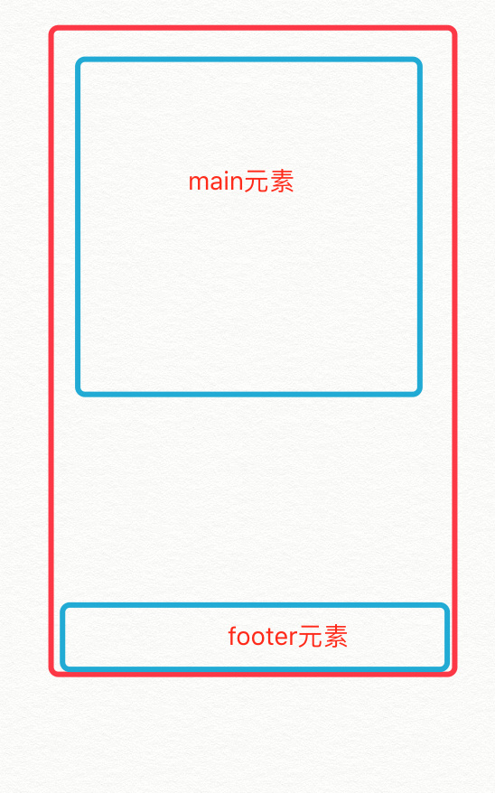
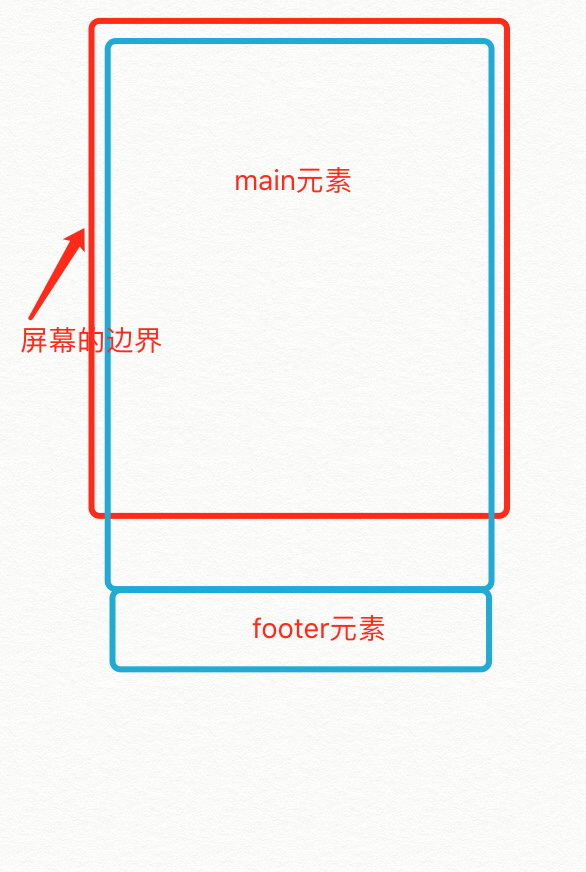

## 粘连布局
经典的“粘连”footer布局就是。我们有一块内容`<main>`。当`<main>`的高度足够长的时候，紧跟在`<main>`后面的元素`<footer>`会跟在`<main>`元素的后面。当`<main>`元素比较短的时候（比如小于屏幕的高度），我们期望这个`<footer>`元素能够“粘连”在屏幕的底部。如下图所示：
* 当main比较短时  

    
    * html结构
    
            

                

            

            

    * 移动端设置meta标签,引入reset样式表
    
              <meta name="viewport" content="width=device-width,initial-scale=1.0,user-scalable=no">
              <link rel="stylesheet" href="reset.css">
    * 设置html，body 的100%显示
    
              html, body {
                width: 100%;
                height: 100%;
              }
    * 设置wrap高度
        
            wrap{
                height: 100%;
            }
    * 设置footer高度和背景色
            
            #footer{
                width: 100%;
                height: 30px;
                background: deeppink;
            }
    * 此时footer被挤到页面底部以外  
      
    * 为footer设置负外边距  
            
            #footer{
                width: 100%;
                height: 30px;
                background: deeppink;
                margin-top: -30px;
            }
            //footer会停留在页面的底部显示
                 
* 当main足够长时  

    
    * html结构
    
                

                    

                        main 
                        main 
                        main 
                        ...... //main的内容超过wrap的高
                    

                

                

                    footer
                

    * 此时footer仍停留在页面底部，但是当拖动页面时，footer不是停留在页面的底部，而是之前wrap的底部
    
        * 设置wrap的高度
                
                 #wrap{
                     min-height: 100%;
                 }
            > 设置了`min-height`，当wrap的子元素不足以撑开wrap时，wrap以高度100%显示，当wrap的子元素超过wrap的高度的时候，wrap的高度由子元素撑开
            
        * 当footer中有文字时，会和wrap中的内容重叠
        
        * 此时需要为 main 设置内边距，为footer预留位置,此时footer会一直停留在页面的底部，并且，footer中的内容不会和main中的内容重叠
         
                #main{
                    padding-bottom: 30px;
                }
            
          
           